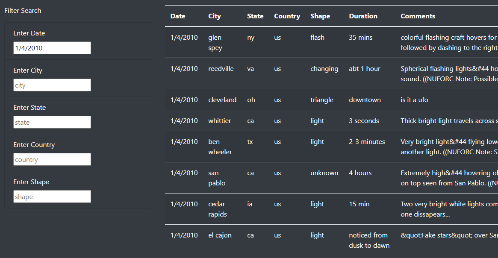
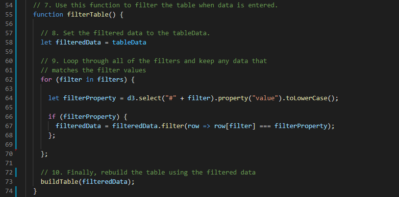

# UFOs Webpage

## UFOs Webpage Overview

This project developed a webpage to display and search information on UFO sightings. Data provided for UFO sightings was tabulated in a dynamic, searchable webpage to provide UFO enthusiasts the ability to search for UFO sightings based on the date, city, state, country, and UFO shape. The table displayed on the page also includes the duration of the sighting and comments from witnesses. Storyboarding was initially used to get an idea for the desired page layout. HTML code was written to create the webpage, and JavaScript was used to make the webpage dynamic. Bootstrap components were also used within HTML to make the page mobile responsive.

### UFOs Webpage Purpose

The purpose of this project was to develop a dynamic, searchable webpage using JavaScript and HTML with boostrap components. This project built upon HTML and general programming skills while introducing JavaScript to create dynamic webpages. The end result was a sleek, modern webpage with multiple search functionality.

## UFOs Webpage Functionality and Use

Storyboarding was used to determine the general layout of the webpage, and the top section of the page is shown in Fig. 1. The webpage begins with an intriguing header, outlined in red, containing a provocative statement and an related picture to bring the topic to life. Below this header, the page contains a secondary header to the left, outlined in yellow, and a few paragraphs to put the page and topic in context that are outlined in green. The page also contains a link in the top left corner, outlined in blue, that will refresh the page and reset the filters used below when clicked.

*Figure 1. Top webpage sections*

The HTML code written to create the upper portion of the webpage is shown in Fig. 2 below.

*Figure 2. Top webpage HTML*

Notice the link to the CSS file on line 14 of the code in Fig. 2. This links to the CSS file that helps set the styling for the page. This file is shown in Fig. 3. On line 3 of the CSS file, the text color is set to white so that it will pop against the dark background of the page. The jumbotron image is also specified and styled in lines 7-10.

*Figure 3. Webpage CSS file*

Below the top portion of the webpage, a table is included to the right with optional filters to the left as shown in Fig. 4. Note that no filters are selected in Fig. 4, and grayed out placeholder text is included in each of the filter input locations.

*Figure 4. Webpage table and filters*

The label for each filter is located above the white filter input box and prompts the user to enter the appropriate information for that filter. The general input format for each filter should be obvious from the table to the right (e.g. two letter abbreviation for the state). Note that since the information in the table is lowercase, the *.toLowerCase()* method is used in the JavaScript file to enable the filters to still function if the use enters uppercase text in the filter inputs. For instance, state and country abberviations are generally uppercase, so if the user enters uppercase text for these abbreviations, the filter will still function correctly.

Screenshots of the filter functionality are included below in Figs. 5-7. In Fig. 5, the date 1/4/2010 is selected as the date to filter, and eight results are shown in the table to the right.

*Figure 5. UFO sightings filtered by date*

From here, the sightings on 1/4/2010 are further filtered by those that occured in California, so 'ca' is entered into the state filter input box. The eight results returned by filtering on 1/4/2010 are reduced to three that occured in CA.

*Figure 6. UFO sightings filtered by date and state*

From here, the sightings that occured on 1/4/2010 in CA are further filtered by the shape designated as 'light'. This leaves two sightings that occured in CA on 1/4/2010 appearing as lights. To clear the filter, all input boxes can be cleared, or the 'UFO Sightings' link can be clicked at the top of the page.

*Figure 7. UFO sightings filtered by date, state, and shape*

The HTML code to create the filters and table structure on the webpage is shown in Figs. 8 and 9.

*Figure 8. HTML code to create filter*

*Figure 9. HTML code to create table structure*

JavaScript was used to make the webpage dynamic with interactive filters. The JavaScript code to filter the UFO data and update the webpage is shown in Figs. 10-14. The code in Fig. 10, reads in the table data as a constant and assigns it to *tableData*, and the code in lines 5-24 builds the table based on the information in the *data* object.

*Figure 10. JavaScript code to read in table data and build the table*

The code in Fig. 11 creates a function to update the filters based on the values entered in the filter input boxes by the user. The code in Fig. 12, is an event listener that detects changes in the filter input boxes, and runs the function defined in Fig. 11 to update the filters.

*Figure 11. JavaScript code to update the filters*

*Figure 12. JavaScript code to listen for changes in the filter inputs*

The code in Fig. 13 is a function that filters the table based on the values in the filter input boxes. Note the *.toLowerCase()* method on line 64. This is used to convert the filter inputs to lower case so that the text matches that in the table. This way, a user can enter uppercase, or lowercase text into the filter inputs, and the code will still work properly.

*Figure 13. JavaScript code to filter the table*

The line of code in Fig. 14 is used to load the full, unfiltered table when the webpage loads, and when the 'UFO Sightings' link is clicked at the top of the webpage. This line of code also ensures that the full table is restored when all filters are cleared.

*Figure 14. JavaScript code to build unfiltered table*

## UFOs Webpage Summary

One drawback of the design of this webpage is that there are no limits on the text the user can enter into the filters. The page could be improved by including drop-down lists on the filter inputs so that the user can only select filter inputs from values that are included in the table. If the user has no plan for what he or she is looking for, the user could spend considerable time simply trying different values to return something from the filters.

Obviously, one recommendation for further development would be to add drop-down lists on the filter input boxes so that the user is forced to select from values that are in the table. This is generally seen with webpages that perform filtering, and it serves to dramatically decrease search time for the user.

Another recommendation for further development is to clean up the table data. For instance, the state and country names could be capitalized to make the information more familiar to the user. The first letter in the city names could also be capitalized. There are also some characters in the table comments that could be cleaned with regex functions. For instance, some of the entries appear to contain ASCII codes for special characters that could be cleaned up for improved readability.
